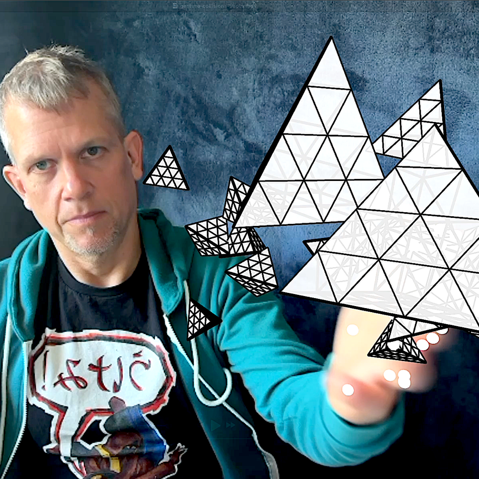

# Three.js Project: Your Hand = Controller

A hand-tracked 3D canvas where your webcam hands control the camera. One hand orbits, two hands zoom, both fists pause.

Watch the project video on [YouTube](https://youtu.be/9Bzmgf5Gpr0)



## How it works

- **One hand visible** — wrist movement orbits the camera (spherical coordinates)
- **Two hands visible** — distance between wrists controls zoom
- **Both fists** — camera freezes (full stop)
- Right hand renders green dots, left hand renders orange in the PIP overlay

## Dependencies

- [Three.js](https://threejs.org/) — 3D rendering
- [MediaPipe Hand Landmarker](https://developers.google.com/mediapipe/solutions/vision/hand_landmarker) — real-time hand tracking

## Running

```bash
npx serve .
```

## License

This project is licensed under the MIT License. Feel free to modify and distribute.
